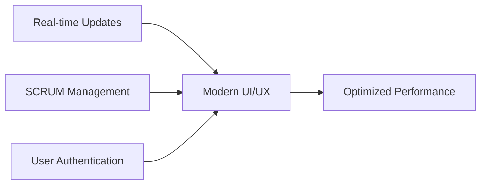
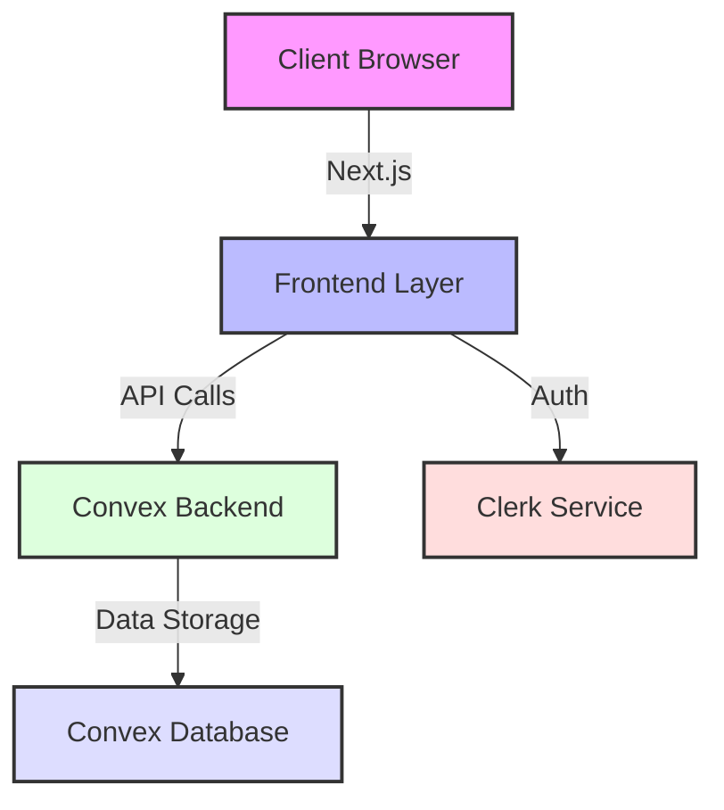

<div align="center">

# 📋 Chira

### A Modern SCRUM Project Management Tool

[](https://nextjs.org/)
[](https://bun.sh/)
[](https://clerk.dev/)
[](https://www.convex.dev/)

[Demo](#) · [Features](#-core-features) · [Tech Stack](#%EF%B8%8F-technology-stack) · [Architecture](#-technical-implementation)

</div>

## 🎯 Project Overview

Chira simplifies the SCRUM process by focusing on essential features needed for sprint planning and ticket tracking. Built with a modern tech stack, it demonstrates real-time updates, user authentication, and responsive design principles.

## 🌟 Key Highlights



## 🛠️ Technology Stack

<div align="center">

| Category    | Technology | Purpose                                          |
| ----------- | ---------- | ------------------------------------------------ |
| 🔥 Frontend | Next.js    | Server-side rendering, routing, React components |
| ⚡ Runtime  | Bun        | JavaScript runtime and tooling                   |
| 🔒 Auth     | Clerk      | User authentication and management               |
| 🚀 Backend  | Convex     | Real-time data sync and backend functions        |

</div>

## ✨ Core Features

### 📅 Sprint Management

- Sprint creation and planning
- Backlog management
- Sprint timeline tracking

### 🎫 Ticket System

- Create and manage user stories
- Track ticket status and progress
- Assign tickets to team members

### 📊 SCRUM Board

- Kanban-style board visualization
- Drag-and-drop functionality
- Real-time updates across all users

## 🏗️ Architecture



### 📁 Project Structure

```
chira/
├── 📱 app/              # Next.js app router and pages
├── 🧩 components/       # React components
├── ⚙️ convex/          # Backend functions and schema
├── 🔧 lib/             # Utility functions
├── 📂 public/          # Static assets
└── 🎨 styles/          # Styling files
```

## 💡 Design Decisions

- **Performance First**: Built with Next.js for optimal loading and SEO
- **Real-time Sync**: Leveraged Convex for instant data updates
- **Security**: Implemented Clerk for robust authentication
- **Developer Experience**: Utilized Bun for enhanced development

## 🚧 Project Status & Roadmap

### Current Progress

| Feature              | Status      |
| -------------------- | ----------- |
| 🟢 Sprint Management | Completed   |
| 🟡 Ticket System     | In Progress |
| 🟡 SCRUM Board       | In Progress |

### Future Plans

| Feature                | Status  |
| ---------------------- | ------- |
| ⚪ Analytics Dashboard | Planned |
| ⚪ Team Collaboration  | Planned |

> **Legend:**
>
> - 🟢 Completed
> - 🟡 In Progress
> - ⚪ Planned
